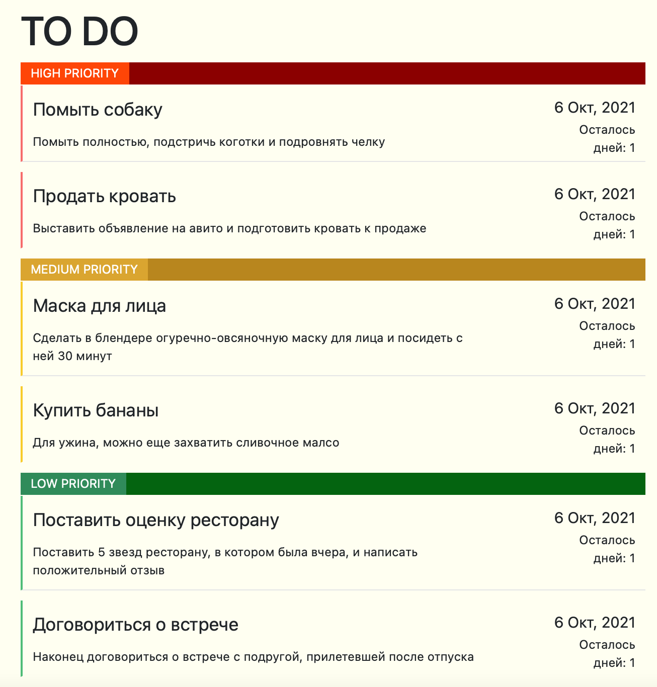
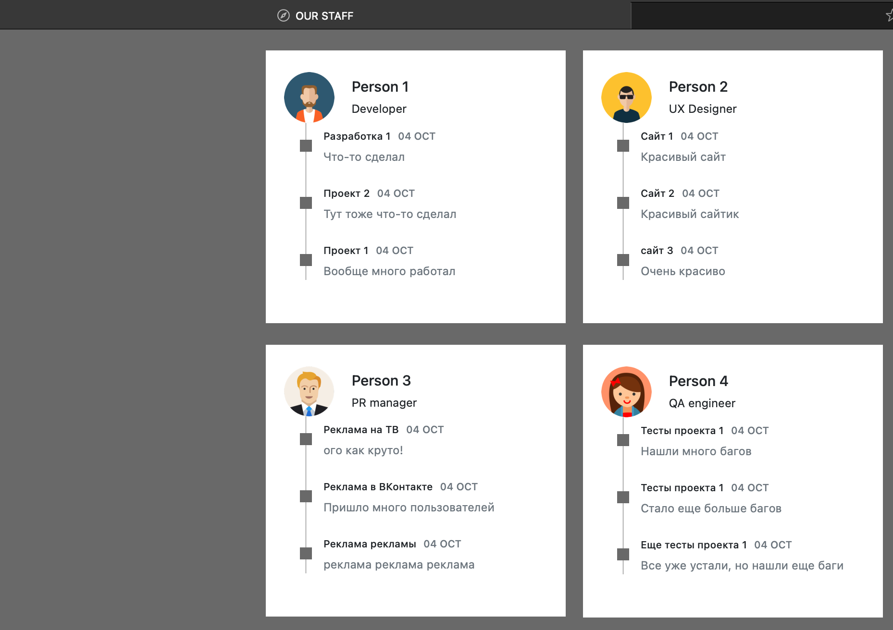
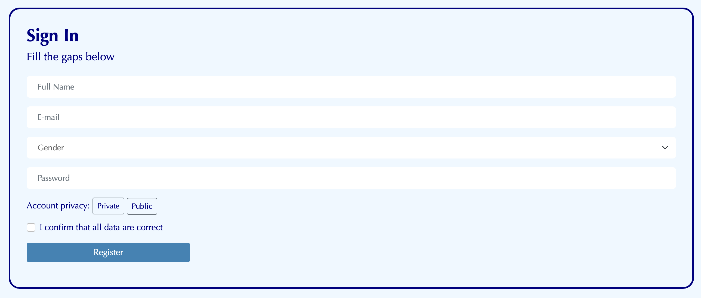

# Результаты выполнения заданий
<h2>Задание 0 (Изменение формы с прошлого семинара)</h2> 
Форма была изменена в соответствии с возможностями bootstrap, был добавлен меню-бар в верхней части страницы и так же карусель с изображениями. 
Полученный результат с демонстрацией смены изображений в карусели и переходами по меню-бару предствалены в виде gif-изображения (рис.1) 

Рис.1

<h2>Задание 1 (TODO список по примеру)</h2> 
Максимально приближено к примеру с небольшими авторскими изменениями в цветах и собственным списком дел (рис.2) 

Рис.2

<h2>Задание 2 (Карты сотрудников компании)</h2> 
Максимально приближено к примеру с небольшими авторскими изменениями в цветах и аватарах сотрудников (рис.3) 

Рис.3

<h2>Задание 3 (Страница регистрации на примере GitHub и похожих сайтов)</h2> 
Старница регистрации пользователья с авторский дизайном(рис.4) 

Рис.4

